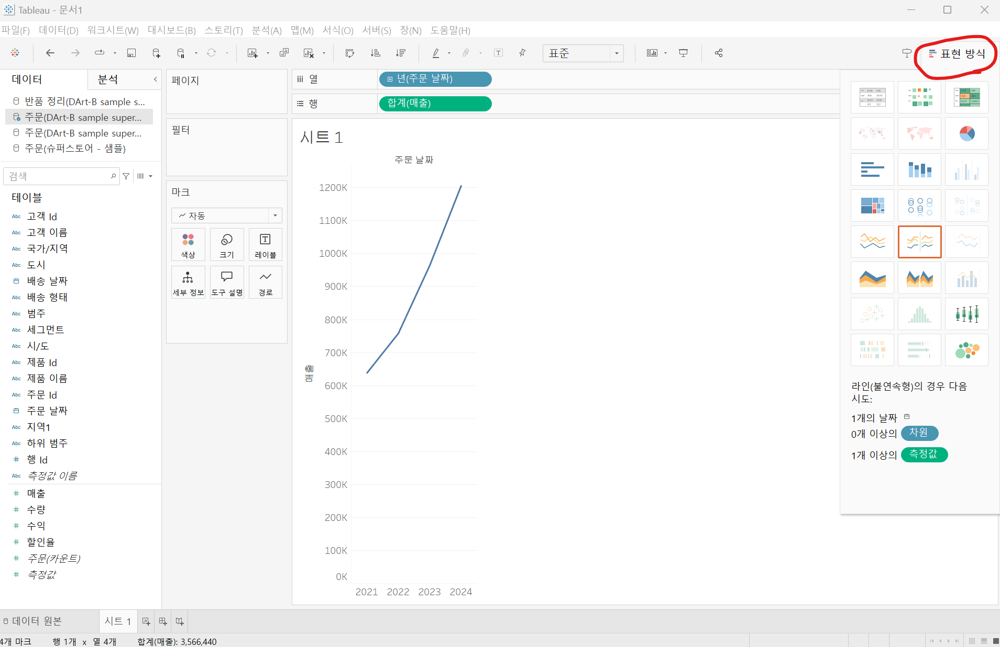

# Second Study Week

- 10강: [차원과 측정값](#10강-차원과-측정값)

- 11강: [시각화](#11강-시각화)

- 12강: [막대그래프](#12강-막대그래프)

- 13강: [누적막대그래프](#13강-누적막대그래프)

- 14강: [병렬막대그래프](#14강-병렬막대그래프)

- 15강: [누적병렬막대그래프](#15강-누적병렬막대그래프)

- 16강: [라인그래프](#16강-라인그래프)

- 17강: [맵작성](#17강-맵작성)

- 18강: [텍스트테이블](#18강-텍스트테이블)

- 19강: [트리맵과 하이라이트테이블](#19강-트리맵과-하이라이트테이블)

- 문제1 : [문제1](#문제1)

- 문제2 : [문제2](#문제2)

- 참고자료 : [참고자료](#참고-자료)


## Study Schedule

| 강의 범위     | 강의 이수 여부 | 링크                                                                                                        |
|--------------|---------|-----------------------------------------------------------------------------------------------------------|
| 1~9강        |  ✅      | [링크](https://youtu.be/3ovkUe-TP1w?si=CRjj99Qm300unSWt)       |
| 10~19강      | ✅      | [링크](https://www.youtube.com/watch?v=AXkaUrJs-Ko&list=PL87tgIIryGsa5vdz6MsaOEF8PK-YqK3fz&index=75)       |
| 20~29강      | 🍽️      | [링크](https://www.youtube.com/watch?v=AXkaUrJs-Ko&list=PL87tgIIryGsa5vdz6MsaOEF8PK-YqK3fz&index=65)       |
| 30~39강      | 🍽️      | [링크](https://www.youtube.com/watch?v=e6J0Ljd6h44&list=PL87tgIIryGsa5vdz6MsaOEF8PK-YqK3fz&index=55)       |
| 40~49강      | 🍽️      | [링크](https://www.youtube.com/watch?v=AXkaUrJs-Ko&list=PL87tgIIryGsa5vdz6MsaOEF8PK-YqK3fz&index=45)       |
| 50~59강      | 🍽️      | [링크](https://www.youtube.com/watch?v=AXkaUrJs-Ko&list=PL87tgIIryGsa5vdz6MsaOEF8PK-YqK3fz&index=35)       |
| 60~69강      | 🍽️      | [링크](https://www.youtube.com/watch?v=AXkaUrJs-Ko&list=PL87tgIIryGsa5vdz6MsaOEF8PK-YqK3fz&index=25)       |
| 70~79강      | 🍽️      | [링크](https://www.youtube.com/watch?v=AXkaUrJs-Ko&list=PL87tgIIryGsa5vdz6MsaOEF8PK-YqK3fz&index=15)       |
| 80~89강      | 🍽️      | [링크](https://www.youtube.com/watch?v=AXkaUrJs-Ko&list=PL87tgIIryGsa5vdz6MsaOEF8PK-YqK3fz&index=5)        |


<!-- 여기까진 그대로 둬 주세요-->
<!-- 이 안에 들어오는 텍스트는 주석입니다. -->

# Second Study Week

## 10강: 차원과 측정값

<!-- 차원과 측정값에 관해 배우게 된 점을 적어주세요 -->
데이터 원본에 연결하는 경우, Tableau는 데이터의 열을 필드로 만들고 데이터의 유형에 따라 필드를 차원 또는 측정값으로 할당.

> **🧞‍♀️ 차원과 측정값의 고유한 특성에 대해 설명해주세요.**

```
- 차원: 정성적인 값을 가지고 있는 필드값(집계되거나 계산되지 않는 독립적인 필드), 

- 측정값: 정량적인 수치값을 가지고 있는 필드값(집계가 가능한 필드)

* 기준선 위가 차원, 기준선 아래가 측정값
```
- 불연속형 필드(개별적으로 구분:문자열), 파란색
- 연속형 필드(단절이 없는 무한한 범위의 값:수), 녹색

*Quiz: 차원은 불연속형이고, 측정값은 연속형이다 (X)*
- 차원과 측정값/연속형과 불연속형은 **서로 다른 개념!** =>차원도 연속형 필드가 될 수 있다.


## 11강: 시각화
- 시각화를 하기 위해서는 먼저 데이터 필드를 시트에 추가해야 한다.
1. 각 필드 더블클릭
2. 필드를 열/행 선반으로 드래그&드롭
3. 필드 하나 선택한 채로 Ctrl => 다른 필드 선택 => 드래그&드롭



화면 오른쪽의 표현 방식을 보면 현재 어떤 방법으로 Tableau가 시각화를 하고 있는지 알 수 있다.

마크를 이용해서도 시각화 방법을 쉽게 변경할 수 있다.

<!-- 시각화 관해 배우게 된 점을 적어주세요 -->

*Quiz: 차원은 대부분 불연속형이며 표 형태로 시각화했을 때 머리글로 표시되고, 측정값은 대부분 연속형이므로 표 형태로 시각화 진행했을 때 패널로 추가된다. O*

## 12강: 막대그래프

<!-- 막대그래프에 관해 배우게 된 점을 적어주세요 -->
- 여러 범주의 데이터를 비교할 때 유용

#### 막대그래프 정렬하기
1. 빠른 메뉴 활용
2. 열에 있는 필드값 우클릭

#### 가로 막대 차트
  - 세로 막대 차트에서 행/열 변환

#### 막대 별 색상 변환
  - 열에 들어갈 필드값을 마크 => 색상에 드래그

#### 그래프 색상 편집하기
  - 마크 => 색상 클릭 => 색상 편집, 팔레트

#### 범례 정렬
  - 범례 우클릭 => 순서 => 필드

#### 마크 창
 - 색상: 색상조절
 - 크기: 막대 크기 조절
 - 레이블: 주석


## 13강: 누적막대그래프

#### 누적막대그래프 만들기
- 마크 => 세부정보 (막대그래프 생성 확인 가능)
- 마크 아래 필드 => 색상 드래그
- Ctrl 키와 함께 다른 필드 => 레이블 (레이블 세부 설정에서 텍스트 순서 변경 가능)

#### 카테고리별 연도매출을 백분율로 표현하기

1. 행 선반의 매출 필드를 우클릭 => 퀵 테이블 계산 => 구성비율
2. 행 선반의 합계 클릭+Ctrl => 마크의 합계로 드래그&드롭

- 이 상태는 전체 연도별 대비 카테고리별 년도가 계산되어 있는 상태
- 카테고리별 연도 매출을 보려면
  - 행 선반 매출필드 우클릭 => 다음을 사용하여 계산 => 테이블(아래로) =>  행 선반의 합계 클릭+Ctrl => 마크의 합계로 드래그&드롭
  - 행 선반 매출필드 우클릭 => 테이블 계산 편집 => 특정 차원 => product category 체크 해제

<!-- 테이블(아래로)와 테이블(옆으로)의 계산 방식을 습득해보세요. 이에 관련해 아래 참고자료도 있습니다 :) -->

## 14강: 병렬막대그래프

<!-- 병렬막대그래프에 관해 배우게 된 점을 적어주세요 -->
#### 병렬막대그래프: 기본 막대그래프를 그룹화해서 나타내는 차트

* 병렬막대그래프를 그릴때는 불연속형 필드를 연속형으로 바꾸어야, 각 막대의 수평위치를 고정하여 그룹을 형성한다.
* 달력의 월이 불연속형이라면?
  * 2020년의 1월과 2024년의 1월을 Tableau는 연도 필드 없이는 구분할 수가 없다.
  * 그러나 필드를 **연속형으로 변경하면 Tableau는 시간의 흐름을 인지할 수 있다.**

#### 불연속형필드를 연속형 필드로 변경
1. 테이블 원본에서 변경
- 바우스 우클릭 후 연속형 필드로 변경
- 표현하려는 뷰마다 데이터를 변경해야 하는 번거로움이 있다.
- 다른 시트에서 사용할 때, 데이터 유형에 있어 충돌이 일어날 수도 있다.
2. 선반에서 변경
- 열 선반에 있는 주문 일자 필드 우클릭 후 연속형으로 변경 (불연속형은 중간 라인 위, 연속형은 중간 라인 아래)
3. 필드를 선반에 넣을 때 변경
- 필드를 '우클릭'하여 선반으로 이동 => 필드 데이터 유형 선택 가능


> *🧞‍♀️ 끊어진 색상으로 배치되어 표현되는 경우와 이어지는 그라데이션 색으로 표현되는 경우 두 가지가 있습니다. 위 사진의 경우 왜 색깔이 끊어지는 색상으로 표시되지 않고 그라데이션으로 표시되었나요? 데이터의 특성과 관련하여 이야기해 봅시다.*

```
열 선반의 필드를 연속형으로 설정했기 때문이다. 
불연속형으로 설정한다면 아래와 같다.
```


## 15강: 누적병렬막대그래프

<!-- 누적병렬막대그래프에 관해 배우게 된 점을 적어주세요 -->
#### 그리는 법
  - 표현방식에서 누적 병렬 막대그래프 선택


연도는 연속형일 때와 불연속형일 때의 차이가 크게 없다.

#### 이중 축을 활용한 누적형 병렬 그래프
- 이중 축: 두 가지 데이터를 하나의 축을 사용해 데이터를 표현하는 방식

**두 개의 필드를 비교** 할 때 사용

- 행 우클릭 => 이중 축 클릭


> *🧞‍♀️ 위 사진에서는 Profit과 Sales를 측정값으로 두었습니다.  개별 칼럼(태블로에서는 #필드라 명칭합니다)을 열/행에 두는 대신, '측정값'을 사용하고 측정값 선반에 필드를 올려둡니다. 이런 방식을 사용하는 이유가 무엇일지, 어떻게 사용할 수 있을지 고민해보세요*

```
'측정값'을 사용하면 두 개의 필드를 한 눈에 비교할 수 있다.
측정값을 사용하는 경우와 사용하지 않는 경우를 비교해 보았는데, 
두 개의 필드의 시점별 데이터를 비교하는 경우에는 측정값을 사용하는 것이 좋아보이고, 
두 개의 필드의 전체적인 추세를 비교할 때에는 측정값을 사용하지 않는 것이 좋아 보인다.
```
<div style="display: flex; justify-content: space-between;">
    
    
</div>

<!-- 정답은 없습니다 -->

## 16강: 라인그래프

<!-- 라인그래프에 관해 배우게 된 점을 적어주세요 -->
#### 용도
- 데이터의 시간별 추세를 확인하거나 
- 해당 데이터를 통해 미래 값을 예측하려는 경우에 많이 사용

*열에 날짜 필드가 있으면 자동으로 라인그래프 완성

*연속형 월: 5월, 6월, 7월...
*불연속형 월: 2024년 5월, 2024년 6월,..., 2025년 5월

## 17강: 맵작성

<!-- 맵차트 관해 배우게 된 점을 적어주세요 -->

```js
## 참고
Country/Region - 나라/지역
State/Province - 시/도
City - 시
County - 군
Postal Code - 우편번호
Area Code - 지역 코드
Airport - 공항
MSA/CBSA (Metropolitan Statistical Area) - 광역 통계 지역
Longitude - 경도
Latitude - 위도
```

## 18강: 텍스트테이블

<!-- 텍스트테이블에 관해 배우게 된 점을 적어주세요-->

## 19강: 트리맵과 하이라이트테이블

> *🧞‍♀️하이라이트 테이블 등에서 두개 이상의 측정값을 사용하는 경우, 함께 색을 표현하게 되면 단위가 달라 정확한 값을 표현할 수 없습니다. 이때 클릭해야 하는 항목은?*

```
여기에 답을 적어주세요!
```


## 문제1

```js
지민이는 superstore의 한국 수출 관리 업무를 맡고 있습니다. 국가/지역이 우리나라, 즉 'South Korea'인 데이터만을 필터링하여, 상품 하위범주 별로 각 하위범주가 매출의 비율 중 얼마만큼을 차지하는지를 트리맵으로 확인하고 싶습니다. 트리맵의 각 네모 안에 표시되는 텍스트에는 **해당 범주의 이름과 전체에서 해당 범주가 차지하는 비율**이 표시되었으면 합니다.

지민이를 도와주세요! (풀이를 찾아가는 과정을 기술해주세요)
```

```
여기에 답을 적어주세요!
```

## 문제2

```js
주현이는 국가/지역별로 매출과 수익의 증감을 시간에 흐름에 따라 표현하고자 합니다. 특히 **한국/중국/일본**을 비교하고자 해당 3국을 남기고 필터링했고, 3개 국가를 매출과 수익이라는 두 가지 지표로 확인해보았습니다.

아래는 위 설명을 표현해본 예시입니다.
```


```js
레퍼런스와 꼭 같지 않아도 자유롭게 표현하고, 그 과정을 기술해주세요.
```

```
여기에 답을 적어주세요!
```

### 참고 자료

```js
테이블 계산에서 '다음을 사용하여 계산'에는 테이블 당 계산과 패널 당 계산이 있습니다. 이에 대해 이해하는 것이 꼭 필요하기 때문에, 외부 레퍼런스를 참고하여 이 단계에서 꼭! 학습 후, 넘어가주세요 :)
```


[참고 외부자료 링크는여기를클릭하십시다](https://velog.io/@eunsuh/Tableau-%EB%A0%88%EB%B2%A8UP-%EA%B0%95%EC%9D%98-%EC%A0%95%EB%A6%AC-1-%ED%85%8C%EC%9D%B4%EB%B8%94-%EA%B3%84%EC%82%B0)


[def]: ..image/t1.png
